# Phase 1 — Data Model: Soyeht Onboarding

Branch: `005-soyeht-onboarding` | Spec: [spec.md](./spec.md) | Plan: [plan.md](./plan.md) | Research: [research.md](./research.md)

This document defines the bootstrap state machine, the entities involved in onboarding, and how state is persisted on disk.

## Bootstrap State Machine

The engine lifetime is governed by a five-state machine. State is persisted to disk so the engine can be restarted without losing position.

```mermaid
stateDiagram-v2
    [*] --> uninitialized: First boot (no household-state/)

    uninitialized --> ready_for_naming: GET /bootstrap/status (listeners up)
    uninitialized --> uninitialized: app-cliente still discovering

    ready_for_naming --> named_awaiting_pair: POST /bootstrap/initialize {name} ✓
    ready_for_naming --> uninitialized: POST /bootstrap/teardown (auth) ✓

    named_awaiting_pair --> ready: First device pessoal pairs (Phase 2 owner-pairing completes)
    named_awaiting_pair --> uninitialized: POST /bootstrap/teardown (auth) ✓

    ready --> recovering: external recovery trigger (out of scope; reserved)
    ready --> uninitialized: POST /bootstrap/teardown (auth) ✓

    recovering --> ready: Shamir reconstruction succeeds
    recovering --> uninitialized: User aborts recovery

    note right of uninitialized
        State dir empty/missing.
        No identity, no listeners
        bound to /api/v1/household/*.
        /bootstrap/* listeners up.
    end note

    note right of ready_for_naming
        Listeners up.
        Engine has indexed
        state dir, found nothing.
        Ready to mint identity.
    end note

    note right of named_awaiting_pair
        hh_priv minted.
        Identity persisted.
        Bonjour publishing
        with pair-device QR active.
    end note

    note right of ready
        Owner-paired.
        Full household stack live.
        /pair-machine/* available.
        Other machines can join.
    end note
```



### State semantics

- **`uninitialized`** — engine fresh: state dir missing or empty. Engine binds bootstrap-only listeners. Endpoints available: `GET /bootstrap/status`, `GET /health`, `POST /bootstrap/claim-setup-invitation`. All `/api/v1/*` endpoints return 503 with `{state: "uninitialized"}` body. Bonjour publishing: only `_soyeht-setup._tcp.` advertising "machine awaiting setup".

- **`ready_for_naming`** — engine has finished startup checks (state dir scan, port binds, no existing identity found). Ready to receive `POST /bootstrap/initialize`. Bonjour publishing same as `uninitialized` (still no household to advertise).

- **`named_awaiting_pair`** — `POST /bootstrap/initialize {name}` succeeded; `(hh_priv, hh_pub)` minted in Secure Enclave / kernel keyring; `household-state/` populated. Engine publishes `_soyeht-household._tcp.` with `pairingState=device` (Phase 2). Listeners for Phase 2 owner-pairing endpoints active. NOT yet receiving Phase 3 machine-join (no pair-machine window open until at least one device is paired).

- **`ready`** — at least one device pessoal (iPhone) is paired. Full household stack available. All endpoints active.

- **`recovering`** — owner triggered recovery flow (out of scope for this spec; state reserved). Engine exposes recovery endpoints, accepts Shamir share submissions from other casa machines, awaits threshold reach. On reach, transitions back to `ready` with restored identity.

### Transitions

| From | Event | To | Side effects | Auth |
|------|-------|-----|--------------|------|
| (none) | engine startup, no `household-state/` | `uninitialized` | bind `/bootstrap/*`, `/health` listeners; publish `_soyeht-setup._tcp.` | n/a |
| `uninitialized` | startup checks complete | `ready_for_naming` | bind ports verified; ready signal in `/bootstrap/status` | n/a |
| `ready_for_naming` | `POST /bootstrap/initialize {name}` valid | `named_awaiting_pair` | mint `(hh_priv, hh_pub)`; persist `household-state/secrets/hh.priv`, `household-state/identity.json`; flip Bonjour to `_soyeht-household._tcp.` with `pairingState=device` | (none — first call defines casa) |
| `named_awaiting_pair` | Phase 2 owner-pairing finalize succeeds | `ready` | persist owner device cert; enable `/pair-machine/*` endpoints; update `device_count=1` in Bonjour TXT | (Phase 2 protocol) |
| any except `recovering` | `POST /bootstrap/teardown` valid | `uninitialized` | atomic `rm -rf` `household-state/`; unbind owner-pairing listeners; revert Bonjour to `_soyeht-setup._tcp.` | owner cert signature (R6) |
| `ready` | external recovery trigger | `recovering` | (out of scope) | (out of scope) |
| `recovering` | reconstruction success | `ready` | (out of scope) | (out of scope) |
| `recovering` | user abort | `uninitialized` | atomic `rm -rf` `household-state/` | (out of scope) |

## Entities

### Casa (Household)

- **Identifier**: `hh_id` — derived deterministically from `hh_pub` via BLAKE3-256 (16 leftmost bytes, base32 lowercase) → format `hh_<base32>`.
- **Identity material**:
  - `hh_priv` — P-256 ECDSA private scalar; **never leaves Secure Enclave** on macOS (Phase 3 carve-out: `THEYOS_FORCE_SOFTWARE_KEYS=1` makes it file-based for ECDH-needing flows); kernel keyring on Linux.
  - `hh_pub` — P-256 SEC1-compressed (33 bytes).
- **Display attribute**: `name` (UTF-8, 1..=64 bytes after sanitization). User-supplied at initialize time. Editable later (out of scope for this spec).
- **Lifecycle**: created at `bootstrap/initialize`; destroyed at `bootstrap/teardown`. Once destroyed, cannot be re-created with same `hh_id` (deterministic from `hh_pub`; new keypair → new `hh_id`).
- **Persistence**: `household-state/identity.json` (public material), `household-state/secrets/hh.priv.bin` (encrypted/SE-bound).

### Máquina (Member machine)

- **Identifier**: `m_id` — derived from `m_pub` via BLAKE3-256 (16 leftmost bytes, base32 lowercase) → format `m_<base32>`.
- **Identity material**:
  - `m_priv` — P-256 ECDSA private scalar; SE on macOS (with software fallback for ECDH); kernel keyring on Linux.
  - `m_pub` — P-256 SEC1-compressed.
- **Display attributes**: `hostname` (sanitized), `platform` (`macos`|`linux`), `host_label` (machine model if detectable; "MacBook Pro", "Linux mini").
- **Role**: `founder` (created the casa) | `member` (joined later via Phase 3 machine-join).
- **Lifecycle**: created when machine first becomes member of a casa (founder at `bootstrap/initialize`; member at machine-join finalize). Persisted in `household-state/members/<m_id>.cbor`.

### Personal device (PT-BR: "device pessoal")

**Terminology note:** code-facing artifacts (this data model, contracts, tasks, code identifiers) use **"Personal device"** as canonical (English per Constitution V). User-facing UI strings use **"device pessoal"** in PT-BR localization and **"personal device"** in EN localization. Both refer to the same entity.

- **Identifier**: `D_id` (Phase 2). iPhone, future Apple Watch.
- **Identity material**: `D_priv` (Secure Enclave / device keychain), `D_pub` (P-256 SEC1).
- **Capability cert**: chain `D_pub` ← signed-by `P_priv` ← signed-by `hh_priv` (Phase 2 protocol).
- **Role**: owner (Phase 2 first iPhone) | additional owner devices (multi-device same person, future).
- **Lifecycle**: paired at `named_awaiting_pair → ready` transition; removable later via revocation (out of scope for this spec). Persisted in `household-state/devices/<D_id>.cbor`.

### Convite de setup (Setup Invitation, Caso B)

- **Identifier**: `token` — 32 random bytes, base64url no-pad encoding.
- **Material**:
  - `token` (32 bytes random)
  - `hh_id` (optional — if iPhone is already in a casa and is helping a NEW Mac join that casa)
  - `owner_display_name` (UTF-8, ≤ 64 bytes)
  - `created_at` (unix seconds)
  - `expires_at` (`created_at + 3600`, 1h TTL)
- **Lifecycle**: minted by Soyeht iPhone before AirDrop. Published in Bonjour `_soyeht-setup._tcp.` TXT. Consumed when Mac engine POSTs `/bootstrap/claim-setup-invitation {token}` and gets validated by iPhone via Tailnet/Bonjour callback. Single-use; expires after 1h regardless.
- **Persistence**: in-memory only on iPhone side (lost if app killed); consumed-side persisted in engine's `household-state/setup-invitations/<token-hash>.cbor` for replay protection.

### Anchor secret (Phase 3 candidate)

- **Identifier**: per pair-machine window (one anchor per candidate join attempt).
- **Material**: 32 bytes CSPRNG, persisted in `household-state/pair_machine_window.cbor` until window terminates.
- **Transport**: traditionally via QR scan (Phase 3 protocol §11/§12, contract `local-anchor.md`); in this spec, also via `GET /pair-machine/anchor-handoff` over Tailnet (capability auth: caller must be in tailnet of the candidate).
- **Lifecycle**: minted at `install_cli::run_pair_machine` (or auto-pair equivalent); destroyed when window closes (commit, abort, or TTL).

## Persistence Layout

```
$THEYOS_DIR/
├── household-state/
│   ├── identity.json                       # public: hh_id, hh_pub (SEC1), name, created_at
│   ├── identity.bootstrap_state            # current state machine state (text: "uninitialized", "ready", etc.)
│   ├── secrets/
│   │   ├── hh.priv.bin                     # encrypted/SE-bound P-256 private; mode 0600
│   │   └── m.priv.bin                      # this machine's m_priv; mode 0600
│   ├── members/
│   │   └── <m_id>.cbor                     # one file per member machine
│   ├── devices/
│   │   └── <D_id>.cbor                     # one file per device pessoal
│   ├── pair_device_window.cbor             # active window for first-iPhone pairing (Phase 2)
│   ├── pair_machine_window.cbor            # active window for machine-join (Phase 3)
│   └── setup-invitations/
│       └── <token-hash>.cbor               # consumed Caso B invitation tokens (replay protection)
└── recent-nonces/
    └── <nonce-hex>                         # 24h cache for teardown nonce replay protection
```

All writes atomic: write to `<file>.tmp`, fsync, rename to `<file>` (existing `household-rs` `atomic_write` pattern).

State machine state transitions write `identity.bootstrap_state` last in the sequence (after the heavy work like `hh_priv` mint), so a crash mid-mint leaves the engine recoverable to a previous state.

## Validation Rules (cross-entity)

- `hh_id == derive_household_id(hh_pub)` — verified at every load (existing rule).
- `m_id == derive_machine_id(m_pub)` — verified at member load.
- `D_pub` cert chain ← `P_priv` ← `hh_priv` — Phase 2 verification at every device cert use.
- Setup invitation `token` valid only if `now < expires_at`, single-use (consumed flag persisted), and verifiable callback to iPhone publisher succeeded.
- Anchor secret valid only within active `pair_machine_window` lifecycle.
- Owner cert teardown signature: see [contracts/bootstrap-teardown.md](./contracts/bootstrap-teardown.md) for the 6-step ordered validation.

## State Machine Persistence Edge Cases

- **Crash during `bootstrap/initialize`**: if `hh.priv.bin` written but `identity.json` not, engine on next boot detects mismatch and aborts to `uninitialized` (atomic `rm` of partial state). Treated as "user aborted naming".
- **Crash during `bootstrap/teardown`**: atomic deletion via temp-rename pattern; if interrupted partway, on next boot engine sees stale `identity.json` without `hh.priv.bin` (or vice versa) and concludes "torn write, complete teardown" — proceeds to fully clear and start `uninitialized`.
- **Power loss during pair-machine join (Story 2 / Phase 3)**: existing protocol covers via window TTL + pair-device-window persistence; no new edge case here.
- **Multiple concurrent `bootstrap/initialize` calls**: serialized via Tokio mutex held in `BootstrapState` Arc; second caller waits or gets `409 conflict` if first call is in-flight.
